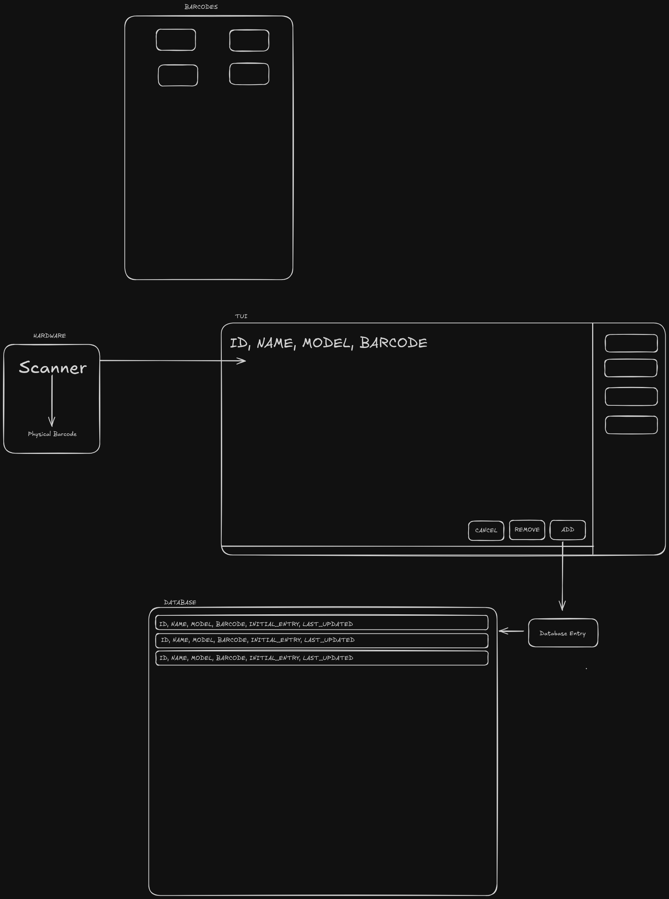

# Introduction

An inventory management terminal user-interface (TUI).

## Philosophy

The overall goal of this project is to keep the elements native to the Python standard library, limiting the reliance on
third-party libraries.
Why?
Think about the scenario when the third-party library becomes deprecated/archived and/or maintaining dependencies
require extensive support.

- Lightweight/Minimal
- Portable
- Maintainable/Scalable

## Tech Stack

- Python
- SQLite
- Textual
- Docker

</img>

## Install Guide

## User Guide

## License

Please refer to [LICENSE](./LICENSE) for more details.

## Contribution & Support

Please follow the [CONTRIBUTING](./CONTRIBUTING.md) guide. Any support is much appreciated!

@Author: capy
